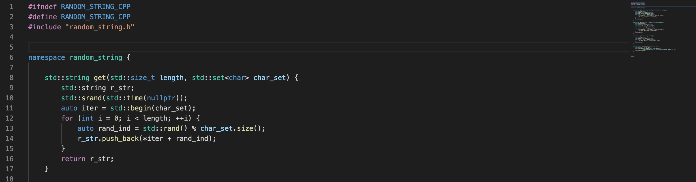
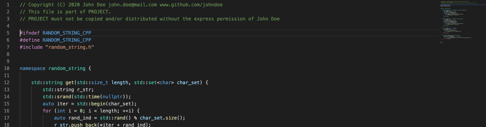

# AutoHeader 

## What does AutoHeader do?
**Add automatic generated headers to you source code.** Without the hassle of adding your personal infomration manually.

Just define tags in the settings and you can use:

- `<name>`	: Name
- `<email>`	: E-mail address
- `<github>`	: GitHub link
- `<date>`	: Current date
- `<year>`	: Current year

⬇️⬇️⬇️

`shift` + `cmd`+ `p`

`> AutoHeader`

## Contributing
If you need any other tags just conact me and help developing AutoHeader! New tags and format specifies can be added easily