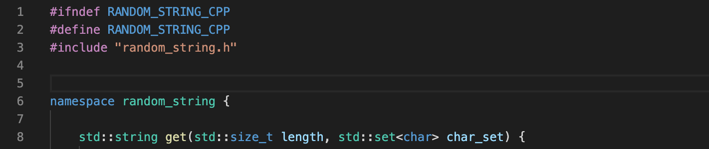
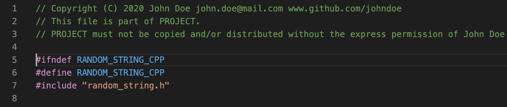

# AutoHeader - Header generator

## What does AutoHeader do?
**Add automatic generated headers to your source code.** Without the hassle of adding your personal infomration manually.

➡️ Define tags in the settings and you can use:

- `<name>`	: 👤 Name
- `<email>`	: 📩 E-mail address 
- `<github>`	: 🌐 GitHub link
- `<date>`	: 📆 Current date
- `<year>`	: 📆 Current year

❌❌❌

✅✅✅

`shift` + `cmd`+ `p`

`> AutoHeader`

## Customizability
Go to `Settings>Extensions>AutoHeader` and customize not only the values used for the tags, but also the template-header. Rearrange, extend or shorten it to fit your needs!

## Contributing
If you need any other tags just conact me and help developing AutoHeader! New tags and format specifiers can be added easily.

Contact me: julianschnabel@outlook.com

Contributions are what make the open source community such an amazing place to learn, inspire, and create. Any contributions you make are **greatly appreciated**.

1. Fork the project
2. Create your feature branch (`git checkout -b feature/AmazingFeature`)
3. Commit your changes (`git commit -m 'Add some AmazingFeature`)
4. Push to the branch (`git push origin feature/AmazingFeature`)
5. Open a pull request

